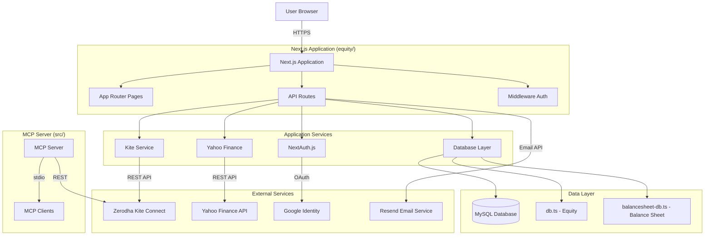

# System Overview

## Project Description

**OneApp Portfolio** is a comprehensive personal finance application that combines:
1. **Equity Portfolio Management**: Track stock investments via Zerodha Kite Connect API
2. **Balance Sheet Tracking**: Manage personal finances (banks, income, expenses)
3. **MCP Server**: Model Context Protocol server for AI-assisted trading operations

## High-Level Architecture

## System Components

### 1. Next.js Web Application (`equity/`)

**Technology**: Next.js 14.2.0 with App Router

**Key Features**:
- Server-side rendering with React Server Components
- API routes for backend functionality
- Client-side interactivity with React Client Components
- Authentication via NextAuth.js
- Database integration via mysql2

**Location**: `equity/app/` (pages and API routes)

### 2. MCP Server (`src/`)

**Technology**: Node.js with TypeScript, MCP SDK

**Purpose**: Provides Model Context Protocol interface for AI assistants to interact with Zerodha Kite Connect APIs

**Key Features**:
- Multi-account support
- Tool-based architecture (authentication, market data, trading, portfolio, GTT)
- Session management
- Credential storage

**Location**: `src/index.ts`, `src/config.ts`

### 3. Database Layer

**Technology**: MySQL 8.0+ with InnoDB engine

**Database Name**: `oneapp`

**Connection Management**: 
- Connection pooling via `mysql2/promise`
- Pool size: 10 connections
- Configuration in `equity/lib/db.ts`

**Tables**:
- **Equity**: `users`, `accounts`, `trades`, `ledger`, `import_conflicts`
- **Balance Sheet**: `bs_categories`, `bs_banks`, `bs_transactions`, `bs_recurring`
- **Sessions**: `sessions`, `verification_tokens` (if long sessions enabled)

## Module Boundaries

### Equity Module

**Location**: `equity/app/` (excluding `balancesheet/`)

**Responsibilities**:
- Portfolio holdings display
- Trade history management
- XIRR calculations
- CSV import (tradebook, ledger)
- Conflict resolution
- Stock split tool

**Key Files**:
- `app/holdings/page.tsx` - Holdings view
- `app/tradebook/page.tsx` - Trade management
- `app/import/page.tsx` - CSV import
- `app/api/stats/route.ts` - Portfolio statistics
- `lib/xirr-calculator.ts` - XIRR calculations

### Balance Sheet Module

**Location**: `equity/app/balancesheet/`

**Responsibilities**:
- Bank account management
- Income/expense tracking
- Category management
- Recurring transactions
- Financial projections

**Key Files**:
- `app/balancesheet/banks/page.tsx` - Bank management
- `app/balancesheet/income/page.tsx` - Income tracking
- `app/balancesheet/expenses/page.tsx` - Expense tracking
- `app/balancesheet/recurring/page.tsx` - Recurring transactions
- `lib/balancesheet-db.ts` - Database operations

### Core Infrastructure

**Location**: `equity/lib/`

**Services**:
- `auth.ts` - Authentication helpers (`getCurrentUser`, `requireAuth`, `requireAdmin`)
- `db.ts` - Database operations for equity module
- `balancesheet-db.ts` - Database operations for balance sheet module
- `kite-service.ts` - Kite API integration
- `xirr-calculator.ts` - XIRR calculations
- `yahoo-finance.ts` - Free stock price fetching

## Data Flow

### Request Lifecycle

1. **Incoming Request**: Next.js middleware (`equity/middleware.ts`) checks authentication
2. **Route Handling**: 
   - Pages: Server Components fetch data directly
   - API Routes: Handle business logic and return JSON
3. **Data Access**: 
   - Equity data: `lib/db.ts` helpers
   - Balance sheet data: `lib/balancesheet-db.ts` helpers
   - Live market data: `lib/kite-service.ts` or `lib/yahoo-finance.ts`
4. **Response**: HTML (pages) or JSON (API routes)

### Authentication Flow

1. **Login**: User submits credentials or uses Google OAuth
2. **Session Creation**: NextAuth.js creates JWT session
3. **Token Storage**: JWT stored in HTTP-only cookie
4. **Request Validation**: Middleware validates session on each request
5. **User Context**: `getServerSession` (server) or `useSession` (client) provides user info

## Security Architecture

### User Isolation

- All data is scoped by `user_id`
- Database queries filter by user ownership
- API routes validate resource ownership
- Foreign key constraints enforce data isolation

### Authentication

- JWT-based sessions (30-day expiration)
- HTTP-only cookies (XSS protection)
- Bcrypt password hashing (cost factor 10)
- Email verification required for new accounts
- Role-based access control (user/admin)

### Authorization

- Middleware protects all routes except public ones
- `requireAuth()` enforces authentication
- `requireAdmin()` enforces admin role
- Resource ownership checks prevent unauthorized access

## External Integrations

### Zerodha Kite Connect

**Purpose**: Live trading data and order execution

**Integration Points**:
- `lib/kite-service.ts` - Service wrapper
- `app/api/kite/*` - API routes for Kite operations
- Credentials stored in `accounts` table

**Features**:
- Multi-account support
- Holdings, positions, margins
- Order placement and management
- Market data (quotes, OHLC, historical)

### Yahoo Finance

**Purpose**: Free stock price data (no authentication required)

**Integration Points**:
- `lib/yahoo-finance.ts` - Price fetching service
- Used by `app/api/stats/route.ts` for portfolio valuations

**Features**:
- Real-time prices for NSE/BSE stocks
- No API key required
- Fallback when Kite API unavailable

### Google OAuth

**Purpose**: One-click sign-in

**Integration Points**:
- `app/api/auth/[...nextauth]/route.ts` - NextAuth configuration
- Automatic account creation for new Google users

### Resend

**Purpose**: Email verification

**Integration Points**:
- `app/api/register/route.ts` - Sends verification emails
- `app/api/verify-email/route.ts` - Verifies email tokens

## Deployment Architecture

**Current Status**: Local development setup documented

**Production Considerations**:
- HTTPS required for OAuth callbacks
- Environment variable management
- Database connection pooling
- Session management
- Error logging and monitoring

See `Documentation/2-Architectural/DevOps-Architecture.md` for detailed deployment information.

