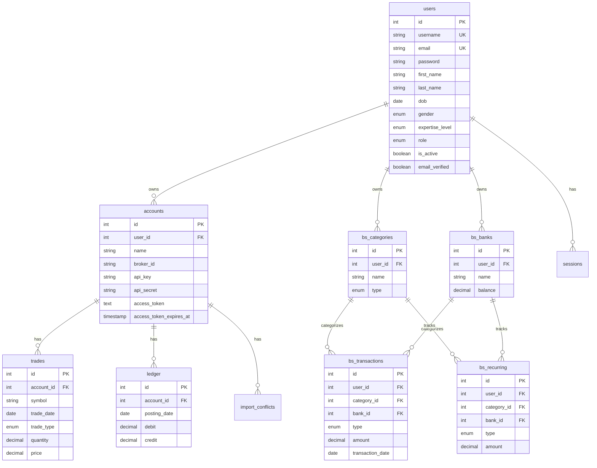

# Entity Relationships

## Entity Relationship Diagram



## Relationship Details

### 1. users → accounts (1:N)

**Type**: One-to-Many  
**Foreign Key**: `accounts.user_id` → `users.id`  
**Cascade**: ON DELETE CASCADE  
**Description**: Each user can have multiple trading accounts.

**Query Pattern**:
```sql
SELECT a.* FROM accounts a
WHERE a.user_id = ?
```

### 2. accounts → trades (1:N)

**Type**: One-to-Many  
**Foreign Key**: `trades.account_id` → `accounts.id`  
**Cascade**: ON DELETE CASCADE  
**Description**: Each account can have many trades.

**Query Pattern**:
```sql
SELECT t.* FROM trades t
INNER JOIN accounts a ON t.account_id = a.id
WHERE a.user_id = ?
```

### 3. accounts → ledger (1:N)

**Type**: One-to-Many  
**Foreign Key**: `ledger.account_id` → `accounts.id`  
**Cascade**: ON DELETE CASCADE  
**Description**: Each account can have many ledger entries.

**Query Pattern**:
```sql
SELECT l.* FROM ledger l
INNER JOIN accounts a ON l.account_id = a.id
WHERE a.user_id = ?
```

### 4. accounts → import_conflicts (1:N)

**Type**: One-to-Many  
**Foreign Key**: `import_conflicts.account_id` → `accounts.id`  
**Cascade**: ON DELETE CASCADE  
**Description**: Each account can have many import conflicts.

### 5. users → bs_categories (1:N)

**Type**: One-to-Many  
**Foreign Key**: `bs_categories.user_id` → `users.id`  
**Cascade**: ON DELETE CASCADE  
**Description**: Each user can have multiple categories.

### 6. users → bs_banks (1:N)

**Type**: One-to-Many  
**Foreign Key**: `bs_banks.user_id` → `users.id`  
**Cascade**: ON DELETE CASCADE  
**Description**: Each user can have multiple bank accounts.

### 7. bs_categories → bs_transactions (1:N)

**Type**: One-to-Many  
**Foreign Key**: `bs_transactions.category_id` → `bs_categories.id`  
**Cascade**: ON DELETE RESTRICT  
**Description**: Each category can have many transactions. Cannot delete category with transactions.

### 8. bs_banks → bs_transactions (1:N)

**Type**: One-to-Many  
**Foreign Key**: `bs_transactions.bank_id` → `bs_banks.id`  
**Cascade**: ON DELETE RESTRICT  
**Description**: Each bank can have many transactions. Cannot delete bank with transactions.

### 9. bs_categories → bs_recurring (1:N)

**Type**: One-to-Many  
**Foreign Key**: `bs_recurring.category_id` → `bs_categories.id`  
**Cascade**: ON DELETE RESTRICT  
**Description**: Each category can have many recurring transactions.

### 10. bs_banks → bs_recurring (1:N)

**Type**: One-to-Many  
**Foreign Key**: `bs_recurring.bank_id` → `bs_banks.id`  
**Cascade**: ON DELETE RESTRICT  
**Description**: Each bank can have many recurring transactions.

### 11. users → sessions (1:N)

**Type**: One-to-Many  
**Foreign Key**: `sessions.user_id` → `users.id`  
**Cascade**: ON DELETE CASCADE  
**Description**: Each user can have multiple active sessions (for OAuth).

## Data Isolation

### User-Scoped Data

All data is isolated by user through:

1. **Direct Ownership**: Tables with `user_id` column
   - `accounts`
   - `bs_categories`
   - `bs_banks`
   - `bs_transactions`
   - `bs_recurring`
   - `sessions`

2. **Indirect Ownership**: Via account relationship
   - `trades` (via `accounts.user_id`)
   - `ledger` (via `accounts.user_id`)
   - `import_conflicts` (via `accounts.user_id`)

### Query Isolation Pattern

**Direct Ownership**:
```sql
SELECT * FROM bs_categories WHERE user_id = ?
```

**Indirect Ownership**:
```sql
SELECT t.* FROM trades t
INNER JOIN accounts a ON t.account_id = a.id
WHERE a.user_id = ?
```

## Referential Integrity

### Cascade Deletes

**ON DELETE CASCADE** (automatic cleanup):
- Deleting a user deletes all their accounts, categories, banks, sessions
- Deleting an account deletes all its trades, ledger entries, conflicts

**ON DELETE RESTRICT** (prevents deletion):
- Cannot delete category with transactions
- Cannot delete bank with transactions
- Cannot delete category with recurring transactions
- Cannot delete bank with recurring transactions

### Unique Constraints

- `users.username` - Unique
- `users.email` - Unique
- `users.google_id` - Unique (nullable)
- `bs_categories(user_id, name, type)` - Unique combination
- `trades(account_id, trade_id)` - Unique per account

## Relationship Queries

### Get User's Accounts with Trade Count

```sql
SELECT 
  a.*,
  COUNT(t.id) as trade_count
FROM accounts a
LEFT JOIN trades t ON a.id = t.account_id
WHERE a.user_id = ?
GROUP BY a.id
```

### Get Account Holdings

```sql
SELECT 
  t.symbol,
  SUM(CASE WHEN t.trade_type = 'buy' THEN t.quantity ELSE -t.quantity END) as holdings
FROM trades t
INNER JOIN accounts a ON t.account_id = a.id
WHERE a.user_id = ? AND a.id = ?
GROUP BY t.symbol
HAVING holdings > 0
```

### Get Balance Sheet Summary

```sql
SELECT 
  b.name as bank_name,
  SUM(CASE WHEN t.type = 'income' THEN t.amount ELSE 0 END) as total_income,
  SUM(CASE WHEN t.type = 'expense' THEN t.amount ELSE 0 END) as total_expense
FROM bs_transactions t
INNER JOIN bs_banks b ON t.bank_id = b.id
WHERE t.user_id = ? AND t.transaction_date >= ?
GROUP BY b.id, b.name
```

