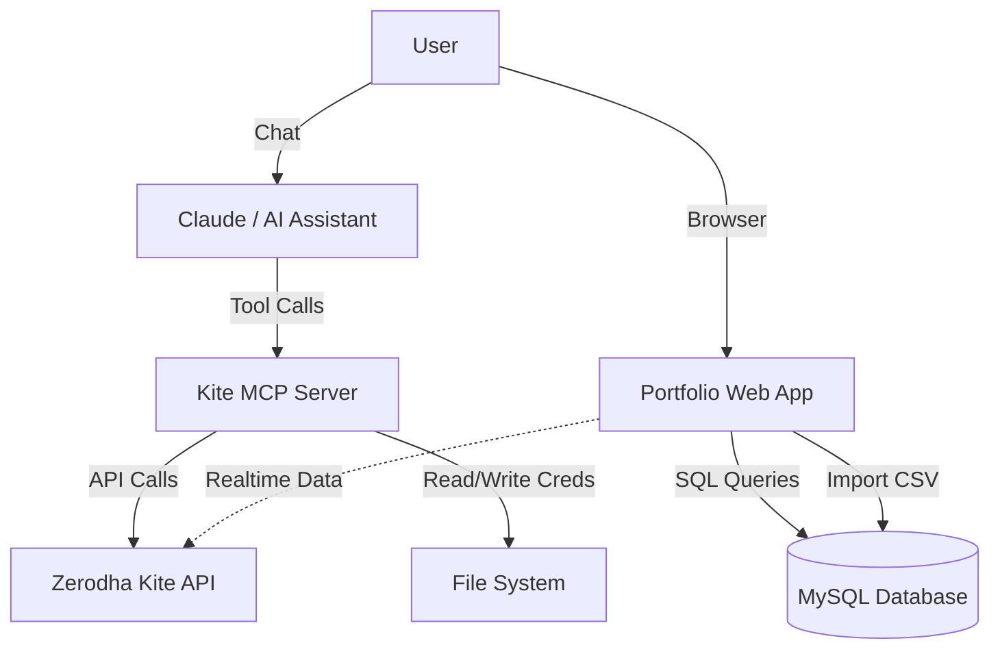

# Service Relationships

## Integration Map

## Dependencies

1.  **MCP Server -> Kite Connect**: Strong dependency. The server cannot function without the Kite Connect library and valid API credentials.
2.  **Web App -> MySQL**: Critical dependency. The app requires the database to render any meaningful data.
3.  **Web App -> Local Environment**: Relies on `.env.local` for configuration, matching the account setup used by the MCP server conceptually (though configured separately currently).

## Shared Concepts
Both services share the concept of **Accounts**. An "Account" (e.g., "Father") identified in the `.env` file of the Web App corresponds to a `client_id` used in the MCP Server tools.

