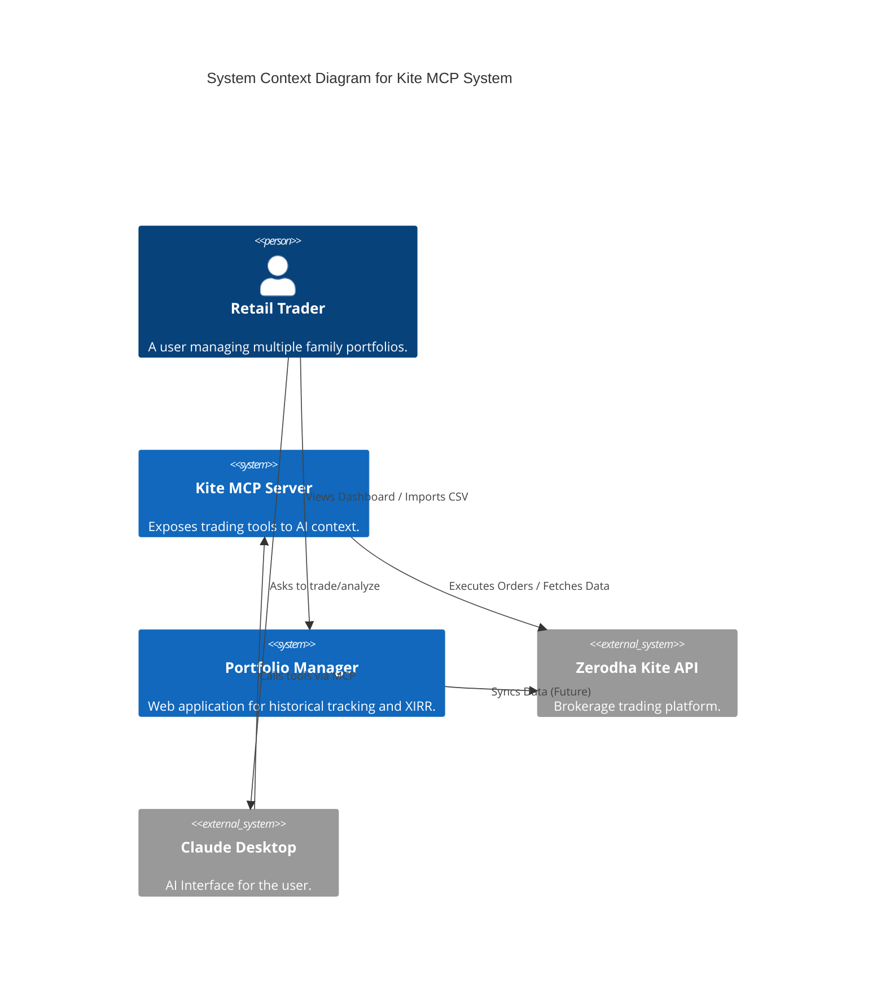
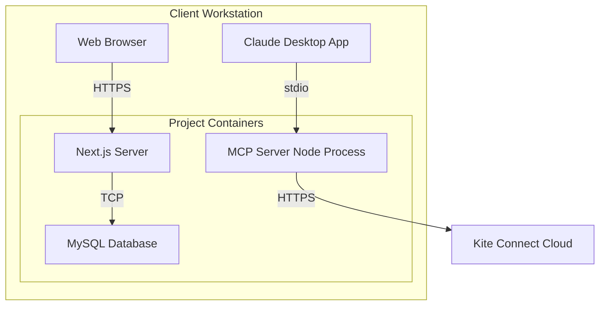

# Architecture Diagram

## C4 Context Diagram (Mermaid)

```mermaid
C4Context
    title System Context Diagram for Kite MCP System

    Person(user, "Retail Trader", "A user managing multiple family portfolios.")
    System(mcp_server, "Kite MCP Server", "Exposes trading tools to AI context.")
    System(web_app, "Portfolio Manager", "Web application for historical tracking and XIRR.")
    
    System_Ext(kite_api, "Zerodha Kite API", "Brokerage trading platform.")
    System_Ext(claude, "Claude Desktop", "AI Interface for the user.")
    
    Rel(user, claude, "Asks to trade/analyze")
    Rel(claude, mcp_server, "Calls tools via MCP")
    Rel(mcp_server, kite_api, "Executes Orders / Fetches Data")
    
    Rel(user, web_app, "Views Dashboard / Imports CSV")
    Rel(web_app, kite_api, "Syncs Data (Future)")
```

## Container Diagram

```mermaid
graph TB
    subgraph "Client Workstation"
        Claude[Claude Desktop App]
        Browser[Web Browser]
        
        subgraph "Project Containers"
            MCP[MCP Server Node Process]
            NextServer[Next.js Server]
            MySQL[MySQL Database]
        end
    end
    
    Cloud[Kite Connect Cloud]
    
    Claude -- stdio --> MCP
    MCP -- HTTPS --> Cloud
    
    Browser -- HTTPS --> NextServer
    NextServer -- TCP --> MySQL
```

