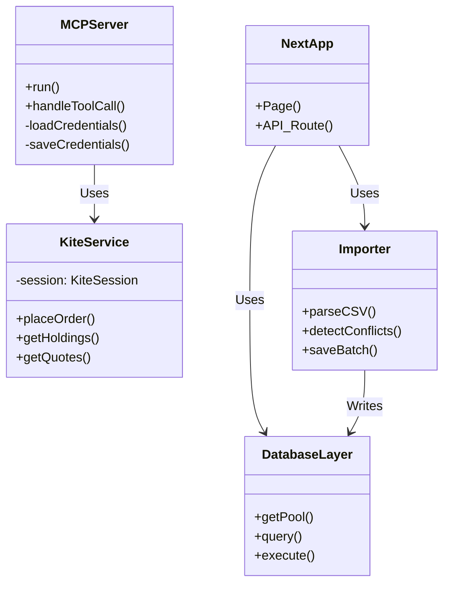

# Component Diagram

```mermaid
classDiagram
    class MCPServer {
        +run()
        +handleToolCall()
        -loadCredentials()
        -saveCredentials()
    }
    
    class KiteService {
        +placeOrder()
        +getHoldings()
        +getQuotes()
        -session: KiteSession
    }
    
    class NextApp {
        +Page()
        +API_Route()
    }
    
    class DatabaseLayer {
        +getPool()
        +query()
        +execute()
    }
    
    class Importer {
        +parseCSV()
        +detectConflicts()
        +saveBatch()
    }

    MCPServer --> KiteService : Uses
    NextApp --> DatabaseLayer : Uses
    NextApp --> Importer : Uses
    Importer --> DatabaseLayer : Writes
```

