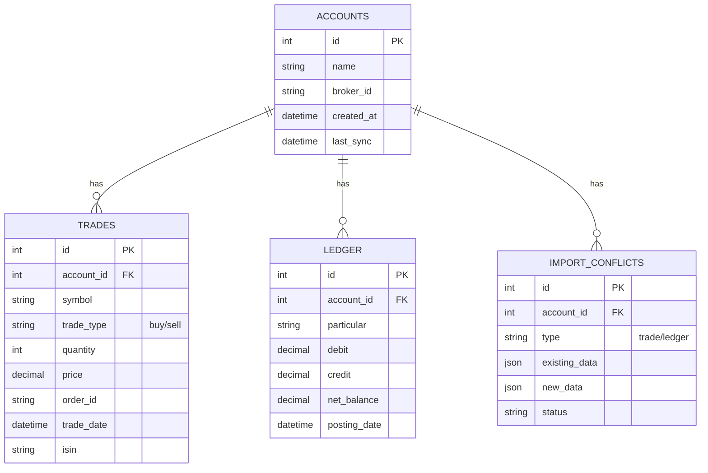

# Database Diagram (ERD)

```mermaid
erDiagram
    ACCOUNTS ||--o{ TRADES : has
    ACCOUNTS ||--o{ LEDGER : has
    ACCOUNTS ||--o{ IMPORT_CONFLICTS : has

    ACCOUNTS {
        int id PK
        string name
        string broker_id
        datetime created_at
        datetime last_sync
    }

    TRADES {
        int id PK
        int account_id FK
        string symbol
        string trade_type "buy/sell"
        int quantity
        decimal price
        string order_id
        datetime trade_date
        string isin
    }

    LEDGER {
        int id PK
        int account_id FK
        string particular
        decimal debit
        decimal credit
        decimal net_balance
        datetime posting_date
    }

    IMPORT_CONFLICTS {
        int id PK
        int account_id FK
        string type "trade/ledger"
        json existing_data
        json new_data
        string status
    }
```

