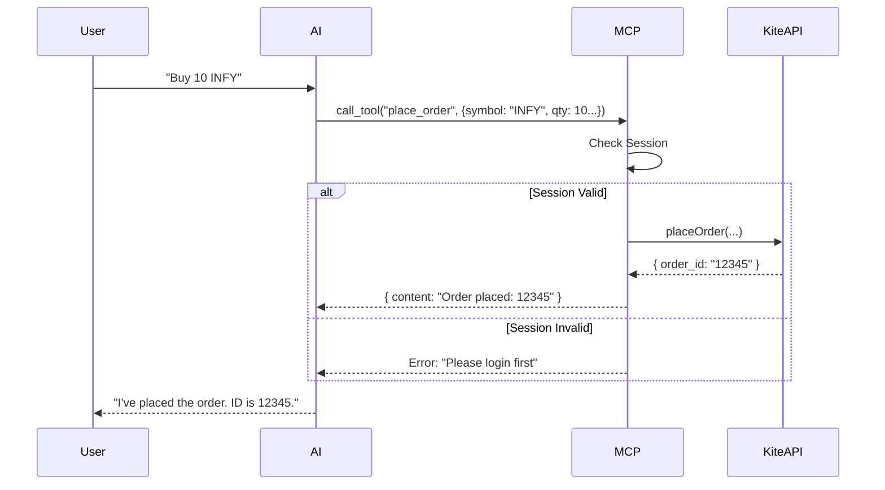
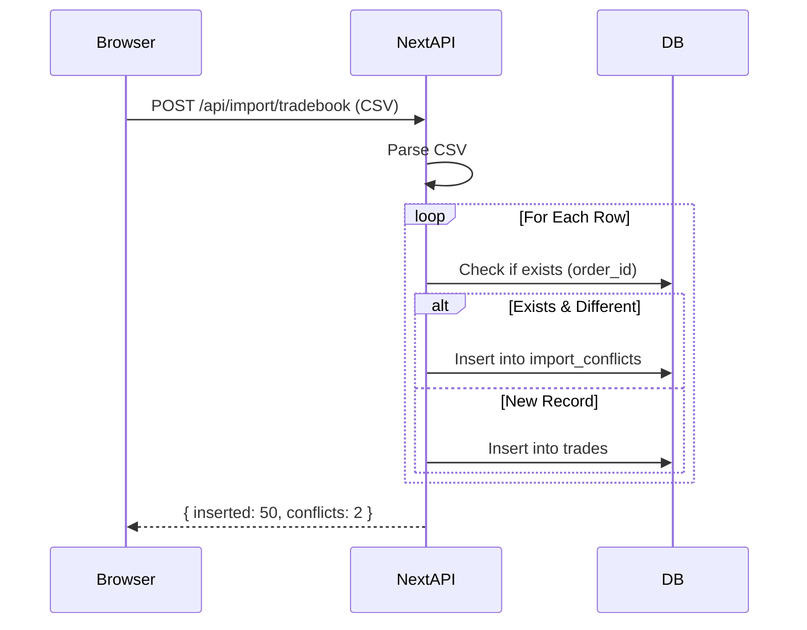

# API Flow

## Sequence: MCP Place Order

```mermaid
sequenceDiagram
    participant User
    participant AI
    participant MCP
    participant KiteAPI

    User->>AI: "Buy 10 INFY"
    AI->>MCP: call_tool("place_order", {symbol: "INFY", qty: 10...})
    MCP->>MCP: Check Session
    
    alt Session Valid
        MCP->>KiteAPI: placeOrder(...)
        KiteAPI-->>MCP: { order_id: "12345" }
        MCP-->>AI: { content: "Order placed: 12345" }
    else Session Invalid
        MCP-->>AI: Error: "Please login first"
    end
    
    AI-->>User: "I've placed the order. ID is 12345."
```

## Sequence: Web App Import Tradebook

```mermaid
sequenceDiagram
    participant Browser
    participant NextAPI
    participant DB

    Browser->>NextAPI: POST /api/import/tradebook (CSV)
    NextAPI->>NextAPI: Parse CSV
    
    loop For Each Row
        NextAPI->>DB: Check if exists (order_id)
        alt Exists & Different
            NextAPI->>DB: Insert into import_conflicts
        else New Record
            NextAPI->>DB: Insert into trades
        end
    end
    
    NextAPI-->>Browser: { inserted: 50, conflicts: 2 }
```

